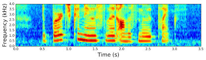
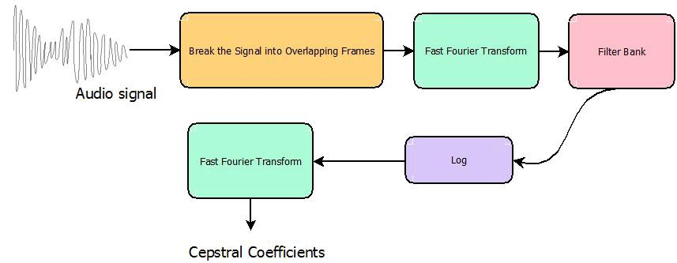
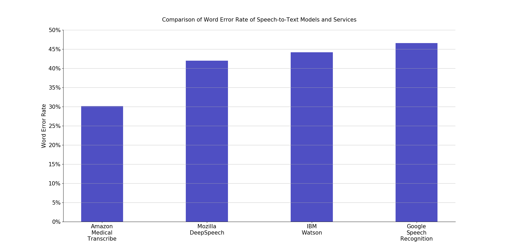
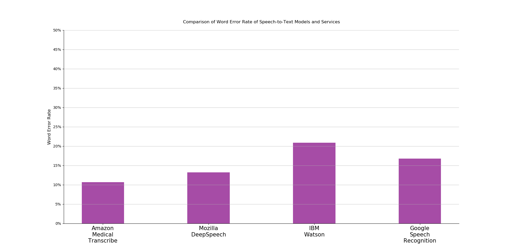
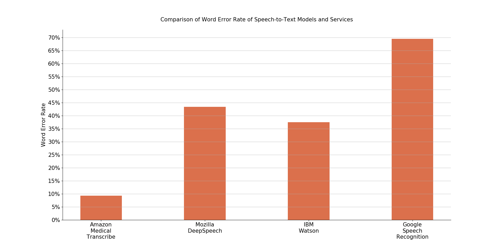

<h1> Experiments for voice based docs app </h1>

<h2> Link to Datasets: </h2>
<ul>
<li>Kaggle: [https://www.kaggle.com/paultimothymooney/medical-speech-transcription-and-intent]</li>
<li>Ezdi: [https://www.ezdi.com/open-datasets/]</li>
<li>Mozilla Voice: [https://voice.mozilla.org/en/datasets]</li>
<li>General STT Dataset: [https://towardsdatascience.com/a-data-lakes-worth-of-audio-datasets-b45b88cd4ad]</li>
<li>Indic TTS Dataset. 
A special corpus of Indian languages covering 13 major languages of India. It comprises of 10000+ spoken sentences/uttererances each of mono and english recorded by both Male and Female native speakers. Speech waveform files are available in .wav format along with the corresponding text.
[https://www.iitm.ac.in/donlab/tts/database.php]</li>
</ul>

As a part of Preprocessing the audio file were converted to <b>.wav</b> with the following format (as required by DeepSpeech):
<ul>
<li>Sampling Rate = <b>16 KHz</b></li>
<li>Buffer int array = <b>16 bit</b></li>
<li>Type = <b>Mono</b></li>
<li>Order = <b>little-endian</b></li>
</ul>

<h2> Feature Extraction:  </h2>
The feature analysis component of an Automated Speaker Recognition (ASR) system plays a crucial role in the overall performance of the system. There are many feature extraction techniques available, but ultimately we want to maximize the performance of these systems. From this point of view, the algorithms developed to compute feature components are analyzed.
<ul>
<li><b>Gammatone Frequency Cepstral Coefficients (GFCC):</b> The GFCC features in recent studies have shown very good robustness against noise and acoustic change.</li>
<li><b>Mel-Frequency Cepstral Coefficients (MFCC): </b>The MFCC are typically the “de facto” standard for speaker recognition systems because of their high accuracy and low complexity; however they are not very robust at the presence of additive noise. But MFCC are used in the current state-of-the-art ASR systems.</li>
</ul>

<h2><b>Mel-frequency cepstral coefficients (MFCC)</b></h2>
MFCCs are the Mel Frequency Cepstral Coefficients. MFCC takes into account human perception for sensitivity at appropriate frequencies by converting the conventional frequency to Mel Scale, and are thus suitable for speech recognition tasks quite well (as they are suitable for understanding humans and the frequency at which humans speak/utter).
Volume, Energy, Pitch, Zero Crossing Rate, Spectral Centroid etc. as some additional features along with MFCC can be used.

<b> MFCC </b>




<b> Signal transformations to extract MFCC coefficients from an audio signal </b>




<h2>Metric: <b>Word Error Rate</b> </h2>

Word error rate (WER) is defined as the ratio of [Levenstein distance](https://en.wikipedia.org/wiki/Levenshtein_distance)
between words in a reference transcript and words in the output of the speech-to-text engine, to the number of
words in the reference transcript

<h2>CTC: <b>Connectionist Temporal Classification</b> </h2>
Connectionist temporal classification (CTC) is a type of neural network output and associated scoring function, for training recurrent neural networks (RNNs) such as LSTM networks to tackle sequence problems where the timing is variable. It can be used for tasks like on-line handwriting recognition or recognizing phonemes in speech audio.

Refer this to know how it works: [https://machinelearning-blog.com/2018/09/05/753/]

<h2> 1: Experimentation: </h2>

<h3> a: Testing different Speech-To-Text Models and Cloud-Services: </h3>

Results based on the test performed on <b>Test-Clean Librispeech Data</b>
<ol>
<li> Amazon Transcribe (<b>WER = 8.21%</b>) </li>
<li> Mozilla DeepSpeech (<b>WER = 7.55%</b>) </li>
<li> Google Speech-to-Text (<b>WER = 12.23%</b>) </li>
</ol>

Now, let us try out these models and cloud services and see where they stand out on the <b>Raw Kaggle dataset</b>.

<h4><b><i>Pricing of Amazon Transcribe:</i></b> Amazon Transcribe API (for both streaming and batch transcription) is billed monthly at a rate of $0.0004 per second. Usage is billed in one-second increments, with a minimum per request charge of 15 seconds.</h4>

<h4><strong> Results on Kaggle dataset: </strong></h4>



<ol>
<li> Amazon Medical Transcribe (<b>WER = 30.09%</b>) </li>
<li> Mozilla DeepSpeech (<b>WER = 41.95%</b>) [Couldn't recognise terms like <i>appendicitis</i>]</li>
<li> IBM Watson (<b>WER = 44.16%</b>) [Couldn't recognise terms like <i>appendicitis</i>]</li>
<li> Speech Recognition Google's API (<b>WER = 46.53%</b>) [Performs fairly well wrt different accents as initial WER were close to 13%, gets worse as Noise and Inaudibility increases.]</li>
</ol>

<h4>Based on the results the following inferences can be drawn.</h4>

<ol>
<li>Data requires proper preprocessing as it includes <i><b>Noise</b></i> and moments of pure <i><b>Silence</b></i>.</li>
<li> The audio files in the Kaggle dataset is mostly comprised of audio recorded in <i><b>Indian Accent</b></i>(English-Language) which could be the problem as the model and the best of the cloud services gave similar performance on the dataset.</li>
</ol>

<h3> b: Third-Party applications: </h3>

<b>Both are paid softwares/services</b>
<ol>
<li><b> Nuance Dragon Medical One </b></li>
    <ul>
        <li>Commands need to learnt or set. </li>
        <li>Punctuations need to be spoken out during examination</li>
        <li>Automatically adapts to the accent and the choice of words of the user with time </li>
        <li>Mistakes in dictation can be reverted back and this helps the model learn.</li>
        <li>Dragon Medical One is designed for Windows PCs, but can also be run on a Mac using Parallels (emulated Windows 10), or BootCamp, because all computation is done in the cloud.</li>
        <li>Can be interfaced with PowerMic Mobile app, used as a microphone</li>
    </ul>

<li><b> Suki </b></li>
    <ul>
        <li>Suki understands context of the doctor's practice and learns the doctor's preferences. Suki determines intent and accurately selects from similar terms (e.g., <i>peroneal</i> vs. <i>perineal</i>) to create 100% accurate notes, as they claim.</li>
        <li>Suki understands variations in speech. No memorizing of commands.</li>
        <li>Powered by a voice assistant application designed for collecting and transcribing notes and patient conversations on behalf of doctors.</li>
        <li>Suki performs tasks beyond note creation. Suki integrates with the EHR so doctors can ask Suki to pull patient information, such as the medication list or vital signs.</li>
        <li>Suki creates orders for doctors, based on their prescribing patterns.  Suki's AI learns preferred dosages, refill amounts, and more, and uses this to generate the order.  The doctor simply needs to review and sign off.</li>
    </ul>

</ol>

<h3> c: Preprocessing: </h3> 

<ol>
<li> Seperating out the Accent component from the signal by dropping out features from MFCC. </li>
<li> Noise removal. </li>
<li> Normalise the pitch, volume and the speed of words spoken.</li>
</ol>

<h3><strong> d: Further tests on Indic TTS dataset: <strong></h3>

250 audio files each were sampled male and female sets of data. The audio files contains speech of native Hindi speakers dictating english sentences.



<ol>
<li> Amazon Transcribe (<b>WER = 10.68%</b>)</li>
<li> Mozilla DeepSpeech (<b>WER = 13.19%</b>)</li>
<li> IBM Watson (<b>WER = 20.84%</b>)</li>
<li> Speech Recognition Google's API (<b>WER = 16.76%</b>)</li>
</ol>

<h2>3. Limitation</h2>
Medical Speech-to-Text data is extremely hard to find due to <b><i>HIPAA privacy regulations</i></b>. Therefore, Medical data is not readily available, especially speech data.


<h2>4. Overcoming limitation of unavailability of parallel Speech-Text Datasets</h2>
<h3> Generate Medical Speech-to-Text Data: </h3>
An attempt was made to generate our own Medical Speech-to-Text Data which could be used to train and test models in the future. 

<ol>
<li>Obtaining Medical Transcripts: Scrape MTSamples.com (https://github.com/curefit/care-transcribe-bot/blob/master/Generated_Medical_STT_Data/ScrapedMT.csv) . <b>MTSamples.com</b> [https://www.mtsamples.com/] is designed to give access to a big collection of transcribed medical reports. MTSamples.com contains sample transcription reports for many specialties and different work types.</li>

<li>Speech data was generated in the following two ways:
<ul>
<li>Using <b><i>gTTS</i></b> (Google Text-to-Speech) engine on the transcriptions to generate corresponding speech data.</li>
<li>Using <b><i>Amazon Polly</i></b> which allows one to Listen, customize, and download speech was used with the following parameters:
    <ul>
    <li>Engine = <b>Standard</b> [<b><i>Note: </i></b>Engine = Neural results in more natural human-like speech but there are limitations on Region (In is not available)]</li> 
    <li>Language and Region = <b>English, In</b></li>
    <li>Voice = <b>Raveena</b></li>
    <li>Sampling rate = <b>16000Hz</b></li> 
    </ul></li>
</li></ol>

<h3><strong> Results from Amazon Polly generated TTS samples: <strong></h3>



<ol>
<li> Amazon Medical Transcribe (<b>WER = 9.25%</b>)</li>
<li> Mozilla DeepSpeech (<b>WER = 43.33%</b>)</li>
<li> IBM Watson (<b>WER = 37.52%</b>)</li>
<li> Speech Recognition Google's API (<b>WER = 69.53%</b>)</li>
</ol>

A marginal difference can be noticed between <b><i>Amazon Medical Transcribe</i></b> and others. The following inferences can be drawn:
<ul>
<li>Other models haven't been trained on Medical exclusive dataset thus fail to identify most of the medical terms.</li>
<li>The dataset was generated using Amazon Polly thus Amazon's other speech related services will perform well when encountered with similar audio type.</li>
</ul>

<h2> 3: Model (Future Work): </h2>

Based on the above experiments, two approaches can be followed to make a custom STT model:

<ul>
<li>Train the DeepSpeech model on medical STT dataset, the required amount of data and computing resources are the limitations though.</li>
<li>Generate custom STT dataset based on the attempts mentioned above and perform <b>Transfer Learning</b> on the Wav2Letter [DenseNet model] trained on LibriSpeech dataset and incorporate a Decoder with CTC decoding to generate text.
</li>
</ul>

<h2> 4. Useful commands: </h2>

Install aws cli
```
pip install awscli
```
Download Transcribed json output files from S3 bucket
```
aws s3 cp s3://<bucket-name>/<dir-name> <local-dir-path> --recursive
```
<b>Use FFMPEG to apply conversions on Audio files</b>
Download and unzip. Add bin to Environment Variables.
'''
https://github.com/amitk526/carebot/blob/master/Resources/ffmpeg/ffmpeg-4.2.3-win64-static.zip
'''
To convert all mp3 files in a directory in Linux:
```
for f in *.mp3; do ffmpeg -i "$f" -acodec pcm_s16le -ac 1 -ar 16000 "${f%.mp3}.wav"; done
```
Or Windows:
```
for /r %i in (*) do ffmpeg -i %i -acodec pcm_s16le -ac 1 -ar 16000 %i.wav
```
In Windows Batch file: 
```
for /r %%i in (*.mp3) do ffmpeg -i "%%i" -acodec pcm_s16le -ac 1 -ar 16000 "%i.wav"
```
You can see file information with file, ffmpeg, ffprobe, mediainfo among other utilities:
```
$ file hjl0bC.wav 
hjl0bC.wav: RIFF (little-endian) data, WAVE audio, Microsoft PCM, 16 bit, mono 16000 Hz

$ ffmpeg -i hjl0bC.wav
[...]
Stream #0:0: Audio: pcm_s16le ([1][0][0][0] / 0x0001), 16000 Hz, mono, s16, 256 kb/s
```


<h2> 5. Setting up DeepSpeech: </h2>

Install DeepSpeech
```
pip3 install deepspeech==0.6.0
```
Download and unzip pretrained model
```
curl -LO https://github.com/mozilla/DeepSpeech/releases/download/v0.6.0/deepspeech-0.6.0-models.tar.gz
```
Update the following file paths in deep.py
```
model_file_path = 'deepspeech-0.6.0-models/output_graph.pbmm'
lm_file_path = 'deepspeech-0.6.0-models/lm.binary'
trie_file_path = 'deepspeech-0.6.0-models/trie'
lm_alpha = 0.75
lm_beta = 1.85
```

<h3> DeepSpeech Real-Time Streaming Transcriber </h3>

Run this to transcribe files in real-time [https://github.com/amitk526/carebot/blob/master/Utility/deepspeechStream.py]

<h2> 6. Resources: </h2>

<ol>
<li>The pretrained English <i>acoustic model</i> and <i>language model</i> for DeepSpeech can be found at: [https://github.com/mozilla/DeepSpeech/releases/download/v0.6.0/deepspeech-0.6.0-models.tar.gz]</li>
<li>Scrapy [https://scrapyd.readthedocs.io/en/stable/] </li>
</ol>